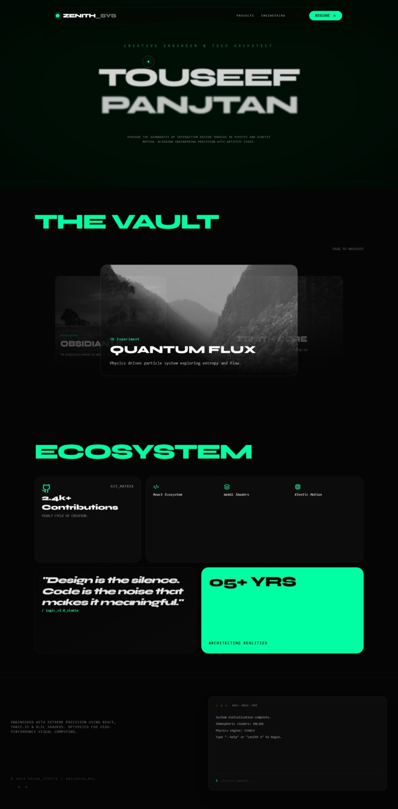

<div align="center">
  

  <h1>🌌Orewa_Zenith Portfolio</h1>
  <p>A High-End Creative Portfolio merging Physics-Based UI with Modern Web Engineering</p>

  <a href="https://orewa-zenith-portfolio.vercel.app/">
    
  </a>
  <a href="https://github.com/touseef78286/orewa_zenith-portfolio">
    
  </a>
</div>

---

## 🌟 Overview
**Orewa_Zenith Portfolio** is a premium digital experience designed to showcase technical expertise through interactive storytelling. Moving beyond static grids, it uses a custom-built physics engine to transform the DOM into a dynamic playground.

### ✨ Key Features
* **🕹️ Gravity-Responsive UI:** Interactive components powered by **Matter.js** that react to user triggers and mouse movements.
* **💎 Bento Grid Architecture:** A clean, modern layout for showcasing projects and skills with high visual impact.
* **🎨 Glassmorphic Aesthetic:** Deep space theme with neon accents, optimized for dark mode.
* **⚡ High Performance:** Built with **Vite** and **TypeScript** for near-instant load times and type-safe code.

## 🛠️ Tech Stack
* **Core:** React (Vite), TypeScript
* **Physics Engine:** Matter.js
* **Animations:** Framer Motion
* **Styling:** Tailwind CSS
* **Deployment:** Vercel

## 🚀 Getting Started

Follow these steps to run the portfolio on your local machine:

1.  **Clone the Repository:**
    ```bash
    git clone [https://github.com/touseef78286/orewa_zenith-portfolio](https://github.com/touseef78286/orewa_zenith-portfolio)
    ```
2.  **Install Dependencies:**
    ```bash
    npm install
    ```
3.  **Run Development Server:**
    ```bash
    npm run dev
    ```
4.  **Build for Production:**
    ```bash
    npm run build
    ```

## 📄 License
This project is licensed under the **MIT License**.

---
<div align="center">
  Developed with precision by <b>Touseef Panjtan</b> 🚀
</div>